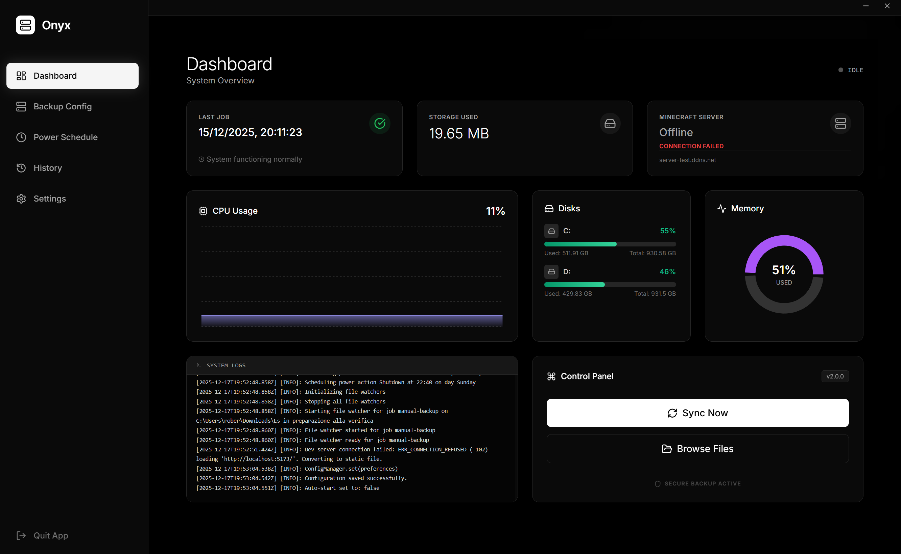

# Onyx Backup Dashboard



A modern, high-performance desktop application for backup, synchronization, and system monitoring. Built with **Electron**, **React**, and **Node.js**, designed with a premium dark aesthetics using TailwindCSS.


## 🚀 Features

### data Protection
- **Smart Backup**: Create one-way backups of your critical folders.
- **Two-Way Sync**: Keep folders in sync across locations.
- **Google Drive Integration**: Seamlessly backup to the cloud with OAuth2 integration.
- **Automated Triggers**:
  - **Scheduled**: Run jobs at specific times.
  - **Automatic**: Real-time file watching triggers backup on changes.
  - **Manual**: Trigger jobs on demand.
- **Exclusions**: Powerful glob pattern matching to exclude unwanted files (e.g., `node_modules`, `*.tmp`).

### 🖥️ System & Monitoring
- **Real-time Dashboard**: Live monitoring of CPU usage, RAM utilization, and Disk space.
- **Power Scheduling**: Automate system Shutdown, Restart, or Sleep sequences.
- **History Tracking**: Detailed logs of all backup and power events.
- **Notification System**: Built-in toast notifications for system events.

### ⚙️ Advanced Configuration
- **Config Export/Import**: Easily migrate your settings between machines.
- **Auto-Start**: Configure the app to launch on Windows startup.
- **System Tray**: Minimized background operation with quick access menu.

## 🛠️ Technology Stack

- **Core**: Electron (v33+)
- **Frontend**: React 18, Vite, Typecript
- **Styling**: TailwindCSS, Lucide Icons
- **Backend**: Node.js, Express (opt), SystemInformation
- **Build System**: Electron Builder (NSIS Installer)

## 📦 Installation

### Prerequisites
- Node.js (v18 or higher)
- npm (v9 or higher)

### Setup
1. **Clone the repository**:
   ```bash
   git clone https://github.com/your-username/onyx-backup.git
   cd onyx-backup
   ```

2. **Install dependencies**:
   ```bash
   # Install backend deps
   npm install
   
   # Install frontend deps
   cd frontend
   npm install
   cd ..
   ```

3. **Development Mode**:
   Running in dev mode requires two terminals:
   
   *Terminal 1 (Frontend):*
   ```bash
   cd frontend
   npm run dev
   ```
   
   *Terminal 2 (Electron):*
   ```bash
   npm start
   ```

4. **Build for Production**:
   Create a standalone `.exe` installer:
   ```bash
   npm run build
   ```
   The installer will be generated in the `dist/` directory.

## 📁 Project Structure

```
├── src/                # Electron Main Process & Backend Logic
│   ├── core/           # Core managers (Backup, Sync, Scheduler)
│   ├── config/         # Configuration handling using JSON
│   ├── assets/         # Static assets (icons)
│   └── main.js         # Entry point
├── frontend/           # React Application
│   ├── components/     # UI Components (Sidebar, Dashboard, etc.)
│   ├── services/       # IPC Bridge Service
│   └── styles/         # Global styles & Tailwind
├── data/               # User data storage (config.json, secrets)
└── dist/               # Build output artifacts
```

## 📝 License

This project is licensed under the ISC License.

---
*Created by Onyx Development Team*
